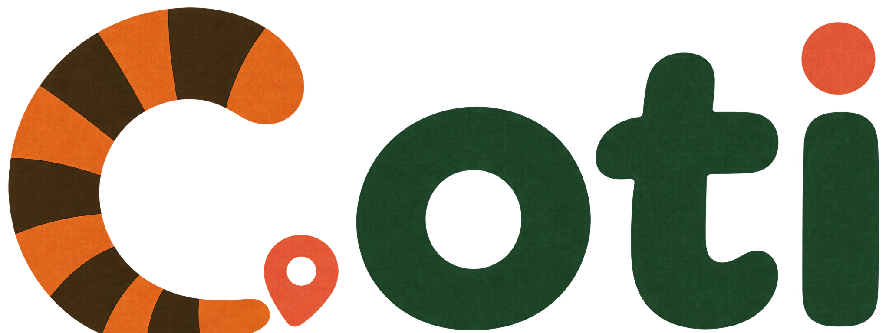
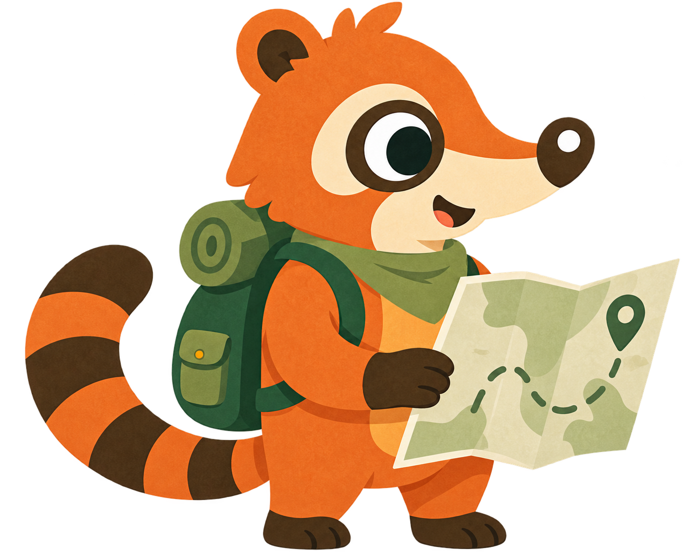
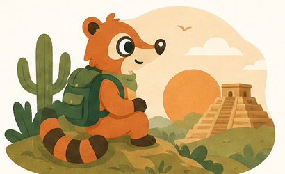
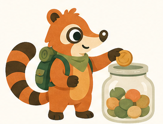
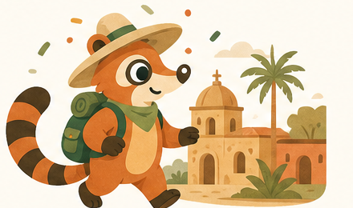
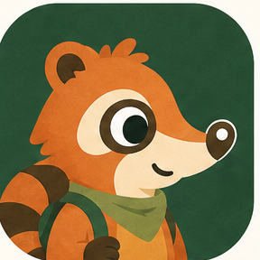

# Coti

  

  

<h3 align="center">Proyecta tu viaje. Ahorra con Coti.</h3>

  Workshop de Claude Code · Wizeline · Agosto 2026

---

## ¿Qué es Coti?

**Coti** es una web app que te ayuda a **proyectar cuánto necesitas ahorrar para un viaje específico** y le da **seguimiento visual** a tu progreso en una *cajita de ahorro*.

> **Esta herramienta proyecta, no reserva.**
> No busca vuelos, no cotiza hoteles, no procesa pagos. Te dice *"este viaje te puede costar entre $X–$Y MXN"* y te acompaña hasta que llegues a la meta.

Nace de la idea [#4 — Ahorro para viajes](.claude/business/ideas/04-ahorro-viajes.md) del banco de ideas del equipo, con el objetivo de combatir la creencia de que conocer el mundo no es accesible a una edad joven.

📄 Especificación completa: [`.claude/business/spec/spec-tecnica-travel-savings-app.md`](.claude/business/spec/spec-tecnica-travel-savings-app.md)

## Estado del proyecto

Proyecto en fase de concepto y preparación para workshop. El repositorio reúne la definición del MVP, decisiones de producto, banco de ideas, perfiles del equipo y el sistema visual de Coti. Todavía no contiene una implementación funcional de la aplicación.

## Estructura del repositorio

| Carpeta | Contenido |
|---|---|
| [`.claude/business/spec/`](.claude/business/spec/) | Especificación técnica de Coti (alcance, flujo de usuario, datos, fases) |
| [`.claude/business/ideas/`](.claude/business/ideas/README.md) | Banco de las 7 ideas propuestas por el equipo |
| [`.claude/business/team/`](.claude/business/team/README.md) | Perfiles de las personas del workshop |
| [`assets/branding/`](assets/branding/) | Identidad visual, guía de marca, iconografía y sprites de Coti |

## Branding

### La mascota

Coti es un **coatí** — el mamífero de cola anillada que recorre México desde la selva hasta el desierto. Curioso, explorador y siempre con la mochila puesta. Va con un mapa en la mano, un pañuelo verde al cuello y una cola que también dibuja la **C** del logotipo.

  
  
  

Las tres escenas cuentan el ciclo del producto: **soñar el destino → ahorrar en la cajita → llegar**.

### Logotipo e ícono

  
  &nbsp;&nbsp;&nbsp;&nbsp;
  

- La **C** es la cola anillada del coatí (naranja + café).
- El punto de la **i** es un pin de mapa coral, igual que el pin bajo la C.
- El ícono de app usa el rostro de Coti sobre verde bosque.

### Paleta

| Muestra | Nombre | Hex | Uso |
|---|---|---|---|
|  | Coral | `#E15D3B` | Acentos, pines de mapa, CTAs |
|  | Mostaza | `#E39B38` | Monedas, sol, progreso de ahorro |
|  | Arena | `#DDB16F` | Fondos secundarios, tarjetas |
|  | Verde bosque | `#305233` | Color primario, tipografía del logo, mochila |
|  | Café | `#503A1C` | Texto, anillos de la cola |
|  | Crema | `#FEFBF3` | Fondo base |

### Tono

Cálido, ilustrado y mexicano sin caer en cliché: pirámides, cactus, pueblos con cúpulas y palmeras. Texturas tipo papel, formas redondeadas, nada de gradientes brillantes. La voz de Coti es la de un amigo que ya viajó y te dice *"sí se puede, vamos a hacer cuentas"*.

### Archivos

| Archivo | Descripción |
|---|---|
| `coti-brand-sheet.png` | Hoja de marca completa (1536×1024) |
| `coti-logo.png` | Logotipo horizontal |
| `coti-logo-transparent.png` | Logotipo horizontal con alfa para README y fondos variables |
| `coti-app-icon.png` | Ícono de app |
| `coti-mascot.png` | Mascota principal con mapa |
| `coti-mascot-transparent.png` | Mascota principal con alfa |
| `coti-scene-*.png` | Escenas ilustrativas (pirámide, cajita, pueblo) |
| `coti-branding-explorador-calido.png` | Dirección visual oficial completa |
| `coti-logo-horizontal-mascota.png` | Lockup horizontal con mascota |
| `coti-app-icon-v2.png` | Exploración refinada del ícono móvil |
| `coti-sprites-explorador-calido-sheet.png` | Hoja de estados y expresiones de Coti |
| `concepts/` | Rutas exploratorias; no usar como identidad principal |

Consulta la [guía profesional de marca](assets/branding/README.md) antes de crear interfaces, campañas o nuevas ilustraciones.

## Principios de producto

- **Proyectar antes que reservar.** Coti entrega rangos creíbles; no vende vuelos ni procesa pagos.
- **Valor antes que datos.** El usuario conoce un rango estimado antes de completar información financiera.
- **Acompañamiento visible.** El progreso de ahorro y los hitos sostienen el hábito durante varios meses.
- **Claridad financiera.** La comunicación debe ser cálida, pero nunca ambigua con costos, fechas o supuestos.

## Cómo contribuir

1. Lee la [especificación técnica](.claude/business/spec/spec-tecnica-travel-savings-app.md).
2. Mantén el alcance del MVP y documenta cualquier decisión que lo amplíe.
3. Sigue la [guía de marca](assets/branding/README.md) al producir UI o contenido.
4. Evita incorporar credenciales, datos personales o artefactos generados temporalmente.

## Equipo

Ver [`.claude/business/team/README.md`](.claude/business/team/README.md).
