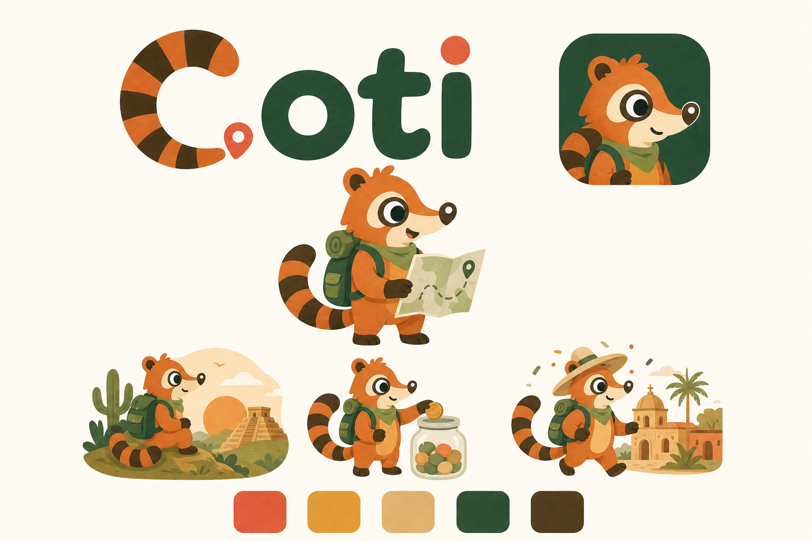
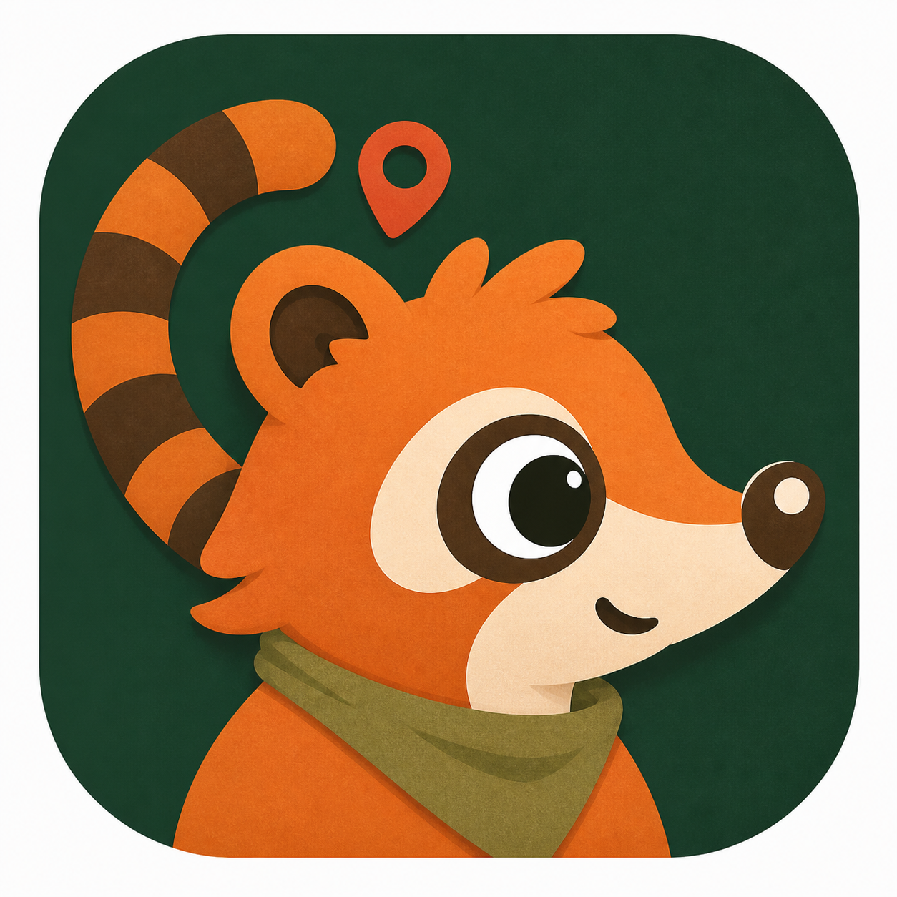

# Guía de marca de Coti

Coti es la identidad de una herramienta de proyección financiera y planificación de ahorro para viajes. La marca convierte una meta que parece lejana en un rango comprensible y un plan alcanzable.

## Dirección oficial

La ruta oficial es **Explorador cálido**. Combina la confianza necesaria para hablar de dinero con el entusiasmo de planear un viaje. Las rutas guardadas en [`concepts/`](concepts/) son exploraciones históricas y no deben mezclarse con la identidad principal.

## Mascota

Coti es un coatí curioso, preparado y cercano. Sus rasgos constantes son:

- Pelaje naranja quemado y hocico crema alargado.
- Cola anillada naranja y café, utilizada también como la letra **C**.
- Pañuelo verde olivo y mochila verde bosque.
- Ojos amplios y atentos, con expresiones claras pero no infantiles.
- Formas orgánicas, redondeadas y con una textura ligera de papel.

Coti acompaña; no regaña ni promete resultados financieros. Puede celebrar avances, explicar rangos, señalar rutas y tranquilizar cuando el plan necesita ajustes.

## Logotipo

El logotipo integra la cola anillada en la **C** y un pin coral como señal de destino. La versión horizontal con mascota se recomienda para encabezados, presentaciones y páginas de bienvenida.

Reglas básicas:

- Mantener espacio libre alrededor equivalente, como mínimo, a la altura de la letra `o`.
- No cambiar la proporción, recolorear elementos por separado ni aplicar sombras fuertes.
- No colocar el logotipo sobre fondos con poco contraste o fotografías recargadas.
- No recrear el nombre con otra tipografía cuando exista un archivo oficial disponible.

## Ícono de aplicación

El ícono utiliza un primer plano del rostro de Coti sobre verde bosque. Debe conservar márgenes amplios para adaptarse al recorte de iOS y Android.

No añadir texto, slogans, insignias o elementos financieros dentro del ícono.

## Paleta

| Token sugerido | Nombre | Hex | Uso principal |
|---|---|---:|---|
| `brand-coral` | Coral | `#E15D3B` | Acciones, pines y énfasis |
| `brand-mustard` | Mostaza | `#E39B38` | Progreso, hitos y celebraciones |
| `brand-sand` | Arena | `#DDB16F` | Superficies secundarias |
| `brand-forest` | Verde bosque | `#305233` | Color principal y fondos oscuros |
| `brand-brown` | Café | `#503A1C` | Texto cálido y detalles de la mascota |
| `brand-cream` | Crema | `#FEFBF3` | Fondo principal |

Para texto normal, validar contraste WCAG AA. Coral y mostaza funcionan mejor como acentos que como texto pequeño sobre crema.

## Voz y tono

La voz de Coti es clara, práctica y optimista. Habla como alguien que conoce el camino y ayuda a hacer cuentas sin juzgar.

**Sí:** “Tu viaje puede costar entre $28,000 y $34,000 MXN. Ajustemos el plan para llegar.”

**No:** “¡Viaja barato garantizado!”

Principios de redacción:

- Expresar estimaciones como rangos, nunca como cotizaciones exactas.
- Explicar supuestos y cambios con lenguaje cotidiano.
- Celebrar constancia y avances, no capacidad adquisitiva.
- Evitar culpa, urgencia artificial y promesas de ahorro garantizado.

## Uso de ilustraciones y sprites

La hoja [`coti-sprites-explorador-calido-sheet.png`](coti-sprites-explorador-calido-sheet.png) reúne estados para bienvenida, cálculo, ruta, ahorro, celebración, apoyo y viaje. Mantener siempre la misma ropa, paleta, proporciones y dirección artística.

El archivo actual es una hoja de referencia rasterizada. Antes de incorporarlo como sprites individuales en producción, deben prepararse recortes independientes y verificar transparencia real.

## Inventario

| Archivo | Estado | Uso |
|---|---|---|
| `coti-brand-sheet.png` | Oficial | Resumen original de la identidad |
| `coti-branding-explorador-calido.png` | Oficial | Dirección visual ampliada |
| `coti-logo.png` | Oficial | Logotipo compacto |
| `coti-logo-transparent.png` | Oficial | Logotipo compacto con alfa para documentación |
| `coti-logo-horizontal-mascota.png` | Oficial | Lockup horizontal |
| `coti-app-icon.png` | Oficial | Ícono compacto original |
| `coti-app-icon-v2.png` | Candidato | Ícono móvil refinado |
| `coti-mascot.png` | Oficial | Mascota principal |
| `coti-mascot-transparent.png` | Oficial | Mascota principal con alfa |
| `coti-scene-*.png` | Oficial | Escenas narrativas |
| `coti-scene-mundo.jpg` | Candidato | Coti frente a un letrero con destinos icónicos (Par&iacute;s, Kioto, El Cairo, R&iacute;o, Nueva York) y monumentos de fondo — libreta de sellos y maleta viajera |
| `coti-scene-safari.jpg` | Candidato | Coti en un safari junto a cr&iacute;as de panda y un guardabosques oso, con letrero de destinos de safari (Serengeti, Kruger, Okavango, Maasai Mara, Victoria Falls) |
| `coti-scene-sendero.jpg` | Candidato | Coti leyendo un mapa junto a un letrero de sendero, lago y monta&ntilde;as de fondo — paleta de oto&ntilde;o |
| `coti-scene-sendero-hero.jpg` | Candidato | Recorte de `coti-scene-sendero.jpg` con espacio negativo amplio a la izquierda — pensado como banner/hero para landing, no como escena narrativa completa |
| `coti-scene-atardecer-hero.png` | Oficial | Paisaje panorámico de atardecer con Coti a la derecha y cielo despejado para titular — hero de la landing (2026-08-29, generado con Codex a partir de la mascota oficial) |
| `coti-scene-letrero.png` | Oficial | Coti sentado en su mochila frente a un letrero de destinos — "Sueña el destino" |
| `coti-scene-cajita-v2.png` | Oficial | Coti metiendo una moneda en el frasco al 40 % — "Ahorra en tu cajita" |
| `coti-scene-pueblo-v2.png` | Oficial | Coti llegando a un pueblo mágico con papel picado — "Llega" |
| `coti-sprites-explorador-calido-sheet.png` | Referencia | Estados de producto |
| `concepts/` | Archivo | Exploraciones descartadas o alternativas |

> Las cuatro escenas `coti-scene-mundo/safari/sendero*` llegaron como JPG (sin canal alfa) el
> 2026-08-29 y están marcadas **Candidato** — pendientes de confirmación como oficiales por
> quien sostiene la identidad de marca antes de promoverlas y de generar sus copias
> optimizadas en `public/brand/scenes/`.

## Entregables para producción

Los PNG actuales son adecuados para concepto, documentación y prototipos. Antes de lanzamiento se recomienda crear originales vectoriales, exportaciones SVG, versiones monocromáticas, favicon, íconos adaptativos de Android y el paquete completo de tamaños para App Store.
